# Find patterns in data which are interesting with respect to background knowledge represented by a Bayesian network

This software is based on the following papers:

<a id="1">[1]</a> S. Jaroszewicz, D. Simovici. *Interestingness of Frequent Itemsets Using Bayesian Networks as Background Knowledge*. In 10th ACM SIGKDD International Conference on Knowledge Discovery and Data Mining (KDD 2004), pages 178-186, Seattle, WA, August, 2004. 

<a id="2">[2]</a> S. Jaroszewicz, T. Scheffer. *Fast Discovery of Unexpected Patterns in Data, Relative to a Bayesian Network*. In 11th ACM SIGKDD International Conference on Knowledge Discovery and Data Mining (KDD 2005), pages 118-127, Chicago, IL, August, 2005.

<a id="3">[3]</a> S. Jaroszewicz, T. Scheffer, D.A. Simovici. *Scalable pattern mining with Bayesian networks as background knowledge*. Data Mining and Knowledge Discovery, 18(1), pages 56-100, 2009.

## What you need:
* Python 3.x
* the numpy package

## How to run the code:
* download the package [source](https://github.com/jszymon/BNInterestingness/archive/refs/heads/main.zip)
* unpack the source
* change to the top level source directory
* type `python BNInterGUI.py`

## Example session
After you type `python BNInterGUI.py` two windows will appear:

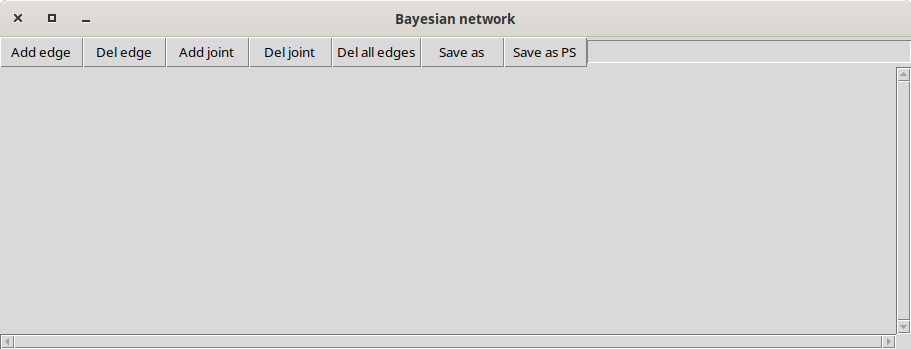
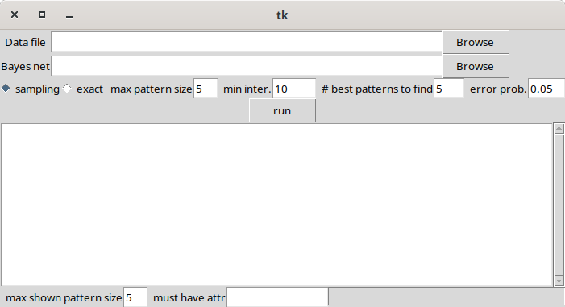

The left window shows the Bayesian network describing current
background knowledge, the right window displays interesting patterns.
Currently both windows are empty.

Let us now load an example dataset.  Click the `Browse` button next to
`Data file` field in the patterns window and select the
`data/ksl_discr.arff` file.   The Bayesian network window should now show a network with no edges:

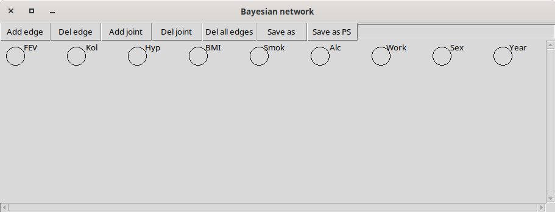

meaning that all variables are assumed to be independent.

Let us now briefly describe the dataset which comes from the `deal` R
package.  The dataset contains data on elderly Danes collected in 1967
and 1984.  All numerical variables are discretized into three levels
0,1,2.  Full variable list is given below:

* **FEV**  Forced Ejection Volume (lung capacity)
* **Kol**  Cholesterol
* **Hyp**  Hypertension {0,1}
* **BMI**  Body Mass Index
* **Smok**  Smoking
* **Alc**  Alcohol consumption
* **Work**  Does the subject work
* **Sex**  Male or Female
* **Year**  Year of the study 1967 or 1984

Let us now discover interesting patterns.  In the pattern window you
can select the algorithm to use (sampling based or exact) as well as
its parameters:

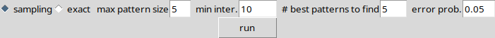

* `max pattern size` maximum size of the discovered pattern
* `min inter` minimum interestingness level of patterns which is used
  for pruning.  Expressed as the minimum number of records of
  difference in pattern frequency in data and based on Bayesian
  network prediction.
* `# best patterns to find` only affects the sampling based algorithm.
  More patterns are actually found, but this number of top patterns is
  guaranteed to be statistically correct.
* `error prob.` upper bound on the probability that one of the top
  patterns is incorrect (only affects the sampling based algorithm).

Select the `exact` algorithm (faster for data with small number of
variables) and click the `Run` button.  Discovered patterns appear in
the pattern window.

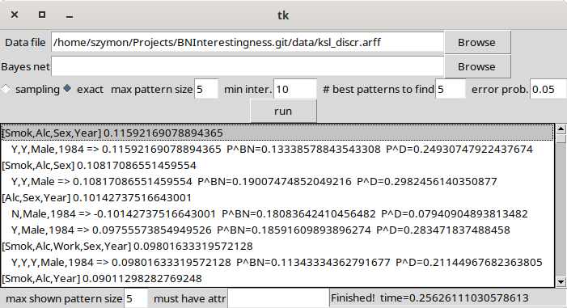

After clicking a pattern, its variables get highlighted in the
Bayesian network window.  The most interesting pattern is
`Smok,Alc,Sex,Year` and the set of values whose probability in data
and Bayesian network differs most is

```
Smok=Y,Alc=Y,Sex=Male,Year=1984
```

The full pattern is not easy to interpret, it is a result of several
sub-dependencies between study year, sex, alcohol consumption and
smoking.  We will see it disappear when more comprehensive background
knowledge is included in the process.

At the bottom of the pattern window there are fields which allow for
filtering discovered patterns.  Let us set `max shown pattern size`
to 2.  The most interesting pattern of size two is `FEV,Sex`.  This
pattern is easy to interpret: women have on average smaller lungs.

We should now update background knowledge to reflect this fact.  Since
person's `Sex` is the cause of smaller lung volume we will add an edge
from `Sex` to `FEV`.  Click `Add Edge` in the Bayesian network window,
then click `Sex` (*from* node) and `FEV` (*to* node).  The change is
reflected in the Bayesian network display:

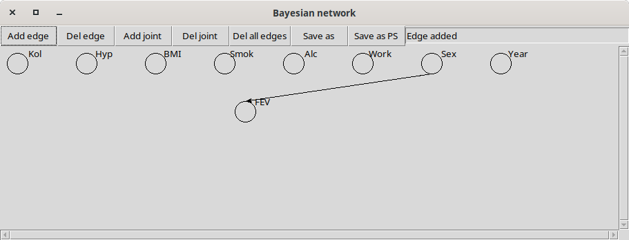

If you click the `Run` button again, the `FEV,Sex` pattern is no
longer interesting, it has been explained away by background
knowledge.  The new pattern is the relationship between smoking and
sex:

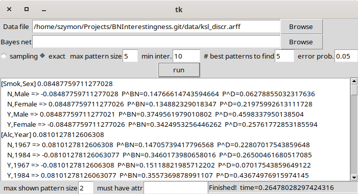

with fewer women being smokers than men.

We could now continue adding more edges to the network to explain more
patterns.  Instead, we will load predefined background knowledge.

## Using background knowledge

Let us now load a Bayesian network representing background knowledge.
Click the `Browse` button next to `Bayes net` field in the patterns
window and select the `data/ksl_discr.net` file.  The background
knowledge comes from [[1]](#1) and represents the authors' common sense
knowledge.

The following network should appear:

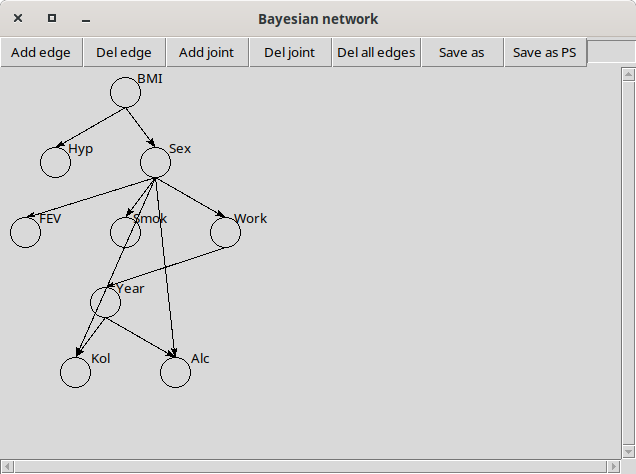

We can now re-run pattern discovery.  Set `max shown pattern size`
back to 5 and click the `Run` button.

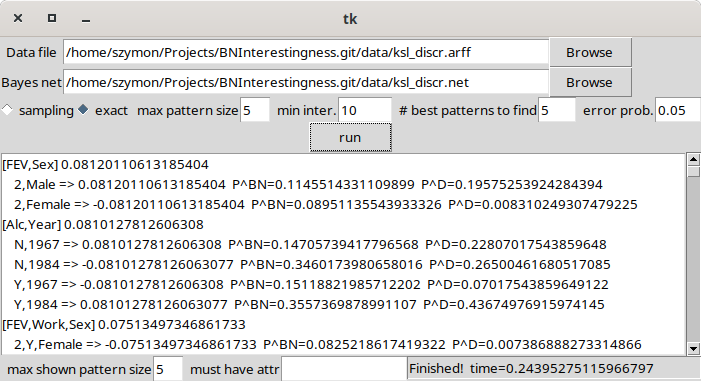

We need to update the background knowledge to include the relationship
between `Sex` and `FEV`.  An edge from `Year` to `Alc` is also
plausible (second most interesting pattern): drinking behavior could
have changed over the years.  The updated network is


After adding those edges new patterns become interesting:

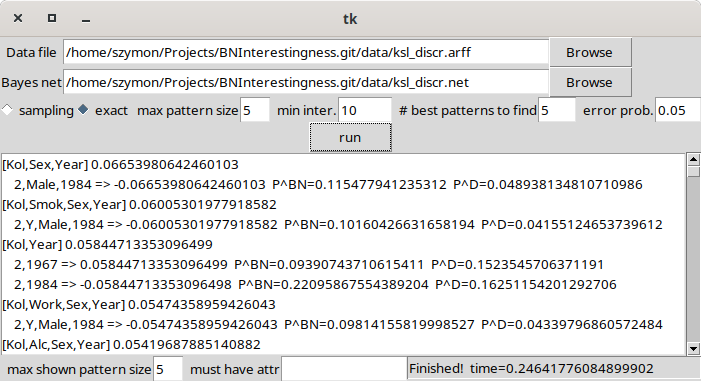

Now the most interesting patterns involve study year, sex, and
cholesterol level (`Kol`).  We update background knowledge by adding
two edges indicating the causal dependence of cholesterol on `Year`
and `Sex`.

The updated network is

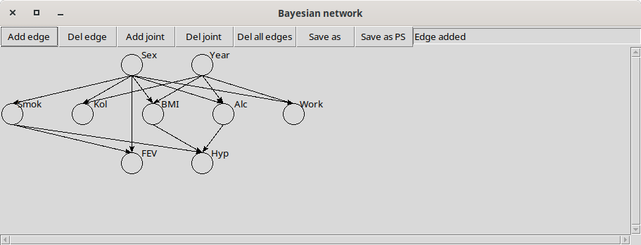

After adding those edges new patterns become interesting:

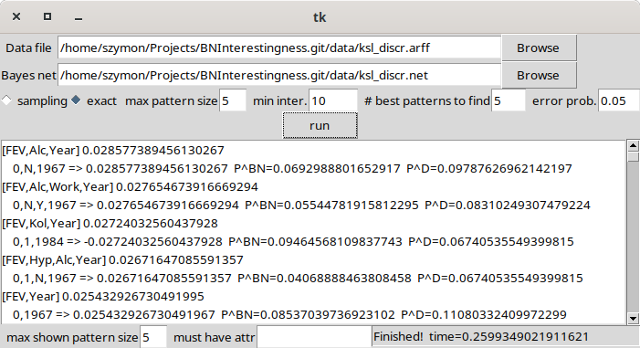

The top patterns are now much harder to explain, and are most probably
the result of spurious correlations.  We may finish the discovery
process.

## Joint nodes

Sometimes there is a set of variables which are dependent but do not
causally influence each other in a simple way.  For example they are
all influenced by latent variables not present in the data.  In this
case it is possible to create a `Joint node` which will model the
joint distribution of several variables.  Variables in a joint node
cannot have parents.

To create a joint node, press the `Add joint` button in the Bayesian
network window, then select variables with left mouse button, and
finish creating the node with a right click.

For example, if you believe `Sex` and `Year` are related due to the
study design, you could model them as a joint node.  Joint nodes are
marked with red frames:

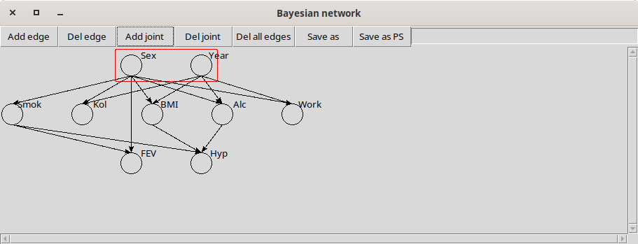

You can also highlight nodes by clicking a pattern and then click `Add
joint` to create a joint node.

## Other examples

Another example is the well known Sachs network and dataset from

<a id="4">[4]</a> K. Sachs et al., *Causal protein-signaling networks
derived from multiparameter single-cell data*, Science 309(5738):1187,
2005.

Some interesting patterns not included in the published network can be
found using the package.
